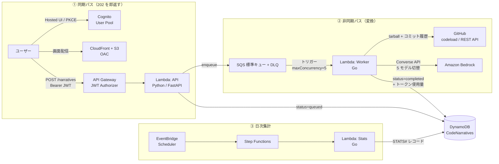

# code-narrative

[](https://github.com/ojos/code-narrative/actions/workflows/deploy.yml)

**GitHub リポジトリの構造と歩みを読み解き、Amazon Bedrock でショートショート（短編小説）へ非同期変換する、フルサーバーレスの AI プラットフォーム。**

🔗 **実動環境: <https://code-narrative.ojos.jp/>**（Cognito Hosted UI でのサインアップ / ログインが必要）

public な GitHub リポジトリの URL を投げると、ディレクトリツリー・README・主要ソース・直近のコミット履歴を材料に、そのプロジェクトの目的と構造をメタファーとして用いた 500 文字程度の物語が返ります。生成モデル（5 ベンダー）と世界観（「サイバーパンク風」「太宰治風」など）は実行時に選択できます。

生成にかかる時間はモデルと対象リポジトリの規模に左右されるため、API は受け付けた時点で `202 Accepted` を即返し、実処理は SQS 経由の Go ワーカーへ切り離しています。**この非同期境界をどう安全に設計したか**が本リポジトリの主題です。

| | |
|---|---|
| **同期 API** | Python / FastAPI + Mangum / Lambda（コンテナ）/ API Gateway HTTP API |
| **非同期ワーカー** | Go / Lambda（コンテナ）/ SQS 標準キュー + DLQ / Amazon Bedrock Converse API |
| **集計バッチ** | Go / Lambda / Step Functions / EventBridge Scheduler（日次） |
| **データストア** | DynamoDB（オンデマンド・GSI） |
| **フロントエンド** | 依存ゼロのバニラ JS（ES モジュール）/ CloudFront + S3（OAC） |
| **認証** | Cognito User Pool（Authorization Code + PKCE）/ API Gateway JWT Authorizer |
| **IaC / CI/CD** | Terraform / GitHub Actions（OIDC・長期キー不使用） |
| **リージョン** | ap-northeast-1（東京） |

## アーキテクチャ



1. **同期パス**: 認証済みリクエストを受け、`job_id` を採番して DynamoDB に `status=queued` を書き、SQS へ投入して `202 Accepted` を返す。ここで LLM を呼ばないため、API のレイテンシはモデルの生成時間から独立します。
2. **非同期パス**: SQS がワーカーを起動し、GitHub からリポジトリを取得 → 物語素材を抽出 → Bedrock Converse API で生成 → DynamoDB を `completed` へ更新。クライアントは結果取得 API のポーリングで完了を知ります。
3. **日次集計**: モデル別利用割合・カスタムプロンプト傾向・トークン使用量合計を集計し、同一テーブルへ `STATS#<date>#<metric>` として書き戻します。

詳細な仕様（エンドポイント定義、DynamoDB 属性、プロンプト構造）は [docs/SPEC.md](docs/SPEC.md) にあります。

## 技術選定と設計判断

### なぜ SQS + Go Lambda で非同期にしたのか

LLM の生成時間はモデルと入力サイズに依存し、API Gateway HTTP API の統合タイムアウト上限（30 秒）に収まる保証がありません。加えて、同期 API のままではクライアントのリトライがそのまま重複生成（＝重複課金）になります。切り離す動機は「速さ」より**失敗を安全に扱えること**にあります。分離した上で、次の 4 点を実装しています。

- **冪等性**: SQS 標準キューは at-least-once 配信のため、同じメッセージが 2 度届きます。ワーカーは `status=queued` の場合にのみ `processing` へ遷移させる条件付き更新（`ConditionExpression`）を入口に置き、二重生成を防ぎます。
- **部分バッチ失敗応答**: イベントソースマッピングで `ReportBatchItemFailures` を有効化し、失敗したメッセージのみを再配信します（バッチ全体の巻き戻しを避ける）。
- **恒久エラーと一時エラーの分離**: 再試行で解決しないもの（モデル利用要件の未充足、存在しないモデル / 推論プロファイル、`ValidationException`、権限不足）は即 `status=failed` に確定させ、**再配信しません**。スロットリング・一時的なサービス不能・モデル未準備は再配信対象とし、未知のエラーは安全側に倒して一時扱いにします（[bedrock.go](apps/lambda-worker/internal/bedrock/bedrock.go) の `IsPermanent`）。4xx を延々とリトライして DLQ を埋める挙動を避けるためです。
- **同時実行と時間の整合**: `maxConcurrency` で Bedrock のスロットリングを抑え、SQS の可視性タイムアウトはワーカーのタイムアウト（300 秒）の 6 倍を Terraform 側で機械的に導出しています（`local.sqs_visibility_timeout = local.worker_timeout * 6`）。両方の数字を手で管理するとずれるためです。`maxReceiveCount` 超過分は DLQ へ退避し、DLQ 滞留数に CloudWatch アラームを張っています。

Go を選んだのは、コンテナイメージとコールドスタートが小さく、tarball の展開・ファイル走査といった I/O 中心の前処理を素直に書けるためです。

### なぜ Amazon Bedrock Converse API なのか

- **API キーを持たない**: 認証は Lambda 実行ロールの IAM のみ。Secrets Manager に LLM のキーを置く必要がなく、漏洩し得る長期資格情報がそもそも存在しません。IAM ポリシーは許可モデルの推論プロファイル / Foundation Model の ARN に限定しています。
- **モデル差分をインターフェースで吸収**: Converse API はベンダーごとのリクエスト形式の違いを吸収するため、`model_id` の差し替えだけで 5 ベンダーを切り替えられます。ベンダー個別 SDK を並べる分岐が不要になります。
- **入力の検証**: `model_id` はリクエストで指定できるため、API 側とワーカー側の**両方**でホワイトリスト照合します（任意モデル呼び出しによるコスト増と規約違反の防止）。

### 東京リージョンでのモデル選定（実装して分かった制約）

ホワイトリストは「ベンダー重複なしの 5 社 × 1 モデル」に落ち着きましたが、これは机上の選定ではなく次の制約の結果です。

| 制約 | 内容 |
|---|---|
| 地理接頭辞 | ap-northeast-1 で Claude を呼ぶには `jp.` 地域推論プロファイル ID が必須。`us.` / `global.` では通らない |
| `temperature` 非対応世代 | Claude Sonnet 5 / Opus 4.7 以降は `temperature` / `top_p` / `top_k` を送ると 400。作風の振れ幅を `temperature=0.8` で作る本設計と両立しないため対象外とした |
| 提供状況 | Llama 3.3 70B は東京で推論プロファイルの提供がないため除外 |
| ドキュメントの信頼順序 | モデル ID は AWS の model card の Programmatic Access 表を正とする（地域一覧ページの要約と食い違うことがある） |

採用: Claude Sonnet 4.5（`jp.` プロファイル）/ Amazon Nova Lite / DeepSeek V3.2 / Qwen3 32B / Gemma 3 12B IT。

### なぜ VPC を作らないのか

DynamoDB・SQS・Bedrock はいずれもパブリックエンドポイント + IAM 認証で到達できます。VPC を構えると NAT Gateway か VPC エンドポイントの固定費が発生し、個人が継続運用する規模ではその費用が支配的になります。よって **VPC を構築せず、認証境界を IAM に寄せる**判断を取りました。代償はコールドスタートの許容と、ネットワーク層での追加防御を持たないことで、後者は IAM 最小権限・JWT 検証・ホワイトリスト検証で埋めています。

### なぜ取得したコードを保存しないのか

DynamoDB には抽出した**要旨（ディレクトリツリー + 選定ファイル名一覧）のみ**を保存し、取得したソースコード全文は保存しません。ワーカーの `/tmp` 上で処理して破棄します。他者のリポジトリの内容を必要以上に永続化しないための設計です。あわせて、tarball 展開後 200MB 超は処理中止、LLM への入力は合計 100KB 上限としています。

## 品質保証

| 対象 | 手段 |
|---|---|
| `apps/api` | pytest（バリデーション / 認証 / 各エンドポイント） |
| `apps/lambda-worker` | `go test`（Bedrock 呼び出し・素材抽出・GitHub クライアント・ストア・ワーカー本体） |
| `apps/lambda-stats` | `go test`（集計ロジック・ストア） |
| `apps/frontend` | `node:test`（PKCE / 設定検証 / モデル一覧 / 入力バリデーション）。テストランナーも含め依存ゼロ |
| `terraform/modules` | `terraform test`（[bedrock_arns.tftest.hcl](terraform/modules/worker/tests/bedrock_arns.tftest.hcl)） |

受け入れ条件は 1 コマンドに束ねてあり、非対話で合否が終了コードに出ます。

```bash
bash scripts/verify.sh   # → VERIFY_PASS / VERIFY_FAIL
```

`terraform test` を CI に入れているのは、**plan では検出できない不変条件**があるためです。たとえば「ホワイトリストに無いモデル ID を入力に与えたとき、IAM ポリシーの ARN が意図通り導出されるか」は、実際に AWS へ問い合わせずに検証したい性質のものです。provider をモックするため AWS 認証が不要で、フォークからの PR でも動きます。

CI/CD（[deploy.yml](.github/workflows/deploy.yml)）は paths-filter で変更のあった対象だけを流します。

- **PR**: `terraform test` → `terraform plan`（結果を PR へコメント）→ 各アプリのテストとコンテナビルド（push なし）
- **main マージ**: ECR を先行 apply → イメージを build & push（`:latest` と `:SHA` を併用）→ 全体 apply → `update-function-code` で `:SHA` を明示ロールアウト → フロントエンドを S3 sync + CloudFront invalidation

初回 apply の時点では Lambda が参照するイメージが存在しないため、ECR 先行 apply → push → 全体 apply の順序を CI 側の手順として固定しています。以降のコードデプロイは `update-function-code` が担い、Terraform は `lifecycle.ignore_changes = [image_uri]` でドリフトを無視します。

## セキュリティ設計

- **長期アクセスキーを持たない**: CI/CD の AWS 認証は GitHub OIDC フェデレーション。人間のアクセスは IAM Identity Center 経由。
- **plan ロールと apply ロールの分離**: plan は読み取り + state バケットのみ、apply は書き込み可。信頼ポリシーで **plan は PR、apply は `environment: production`（immutable な OIDC sub）** に固定しているため、PR ブランチから apply ロールを引くことは構造的にできません。`environment` を外すと sub が変わり AssumeRole 自体が失敗します。
- **本番適用の承認ゲート**: apply ジョブは `environment: production` に紐づき、必須レビュアーの承認を経て実行されます。
- **認証と認可**: フロントは Authorization Code + PKCE（Implicit フロー不使用、クライアントシークレットなし）。API Gateway の JWT Authorizer で検証した上で、結果取得時は JWT の `sub` とレコードの `user_id` を照合し、他人のジョブには `404` を返します（存在の有無を漏らさない）。
- **配信**: S3 は OAC でオリジンアクセスを CloudFront に限定。API の CORS は公開オリジンのみ許可。
- **アカウント分離**: AWS Organizations の専用子アカウント `code-narrative-prod`（Workloads/Prod OU）で稼働。
- **秘密の非コミット**: 通知先メールアドレス等の環境固有値は tfvars / リポジトリ変数で管理し、コードにハードコードしません。フロントの実行時設定（`config.js`）は CI が Terraform outputs から生成します。

## コスト統制

個人が自費で常時稼働させる前提のため、「使わなければ課金されない」構成と、暴走時に気づける仕組みを両方置いています。

- **固定費の排除**: VPC / NAT Gateway なし。Lambda・API Gateway・SQS はリクエスト課金、DynamoDB はオンデマンド。
- **AWS Budgets**: 月次しきい値 20 USD に対し 50 / 80 / 100% および予測超過で通知（[terraform/bootstrap/cost.tf](terraform/bootstrap/cost.tf)）。
- **Cost Anomaly Detection**: 想定外の増加を検知。
- **LLM 側の上限**: `maxTokens: 2048`、LLM への入力は 100KB 上限、`maxConcurrency` でワーカーの並列度を制限。
- **可視化**: Bedrock レスポンスの `usage`（入出力トークン数）をジョブごとに保存し、日次集計でモデル別の使用量を集計します。

## リポジトリ構成（モノレポ）

```text
code-narrative/
├── apps/
│   ├── api/                # 同期 REST API (Python / FastAPI + Mangum / Lambda)
│   ├── lambda-worker/      # 非同期ワーカー (Go / Bedrock Converse API)
│   ├── lambda-stats/       # 日次集計バッチ (Go / Step Functions タスク)
│   └── frontend/           # 管理画面 (バニラ JS / CloudFront + S3)
├── terraform/
│   ├── bootstrap/          # 子アカウント初期構築(state基盤・OIDC・コスト統制)。ローカルstateで手適用
│   ├── environments/
│   │   └── prod/           # アプリ基盤一式(S3バックエンド)。CI/CD から適用
│   └── modules/            # 責務ごとの再利用モジュール(1 モジュール 1 責務)
├── docs/                   # 仕様・intake 記録・作業ログ
├── scripts/                # 受け入れ検証・レビューゲート・開発環境セットアップ
├── .ai-playbook/           # AI エージェント運用の規範(共通ルール・ロール契約・タスク手順)
└── .github/workflows/      # CI/CD (plan on PR / apply on main)
```

各アプリの詳細は [apps/api/README.md](apps/api/README.md) / [apps/lambda-worker/README.md](apps/lambda-worker/README.md) / [apps/frontend/README.md](apps/frontend/README.md)、インフラは [terraform/README.md](terraform/README.md) にあります。

## ローカルでの実行

開発環境は Dev Container として定義済みです（[.devcontainer/](.devcontainer/)）。Go / Node.js / Python / Terraform / AWS CLI / GitHub CLI が揃った状態で起動します。

```bash
# 受け入れ条件（全アプリのテスト）を一括実行
bash scripts/verify.sh

# 個別に実行する場合
(cd apps/api           && uv sync --frozen && uv run --frozen pytest)
(cd apps/lambda-worker && go test ./...)
(cd apps/lambda-stats  && go test ./...)
(cd apps/frontend      && npm ci && npm test)
```

テストは AWS へアクセスしません（外部依存はモック / フェイク）。フロントエンドをローカルで開く場合は `apps/frontend/config.example.js` を `config.js` へコピーし、自分の Cognito / API の値を設定してください（実値はコミットしません）。

インフラの適用手順（bootstrap → prod の順序、必要なリポジトリ変数）は [terraform/README.md](terraform/README.md) を参照してください。

## AI エージェント運用

このリポジトリは実装の大半を AI エージェントとの協働で進めており、そのための規範と機械ゲートもリポジトリ内に置いています。

- [.ai-playbook/](.ai-playbook/) — 共通ルール、ロール契約、タスク手順、レビュー運用。実行環境ごとの入口ファイル（[CLAUDE.md](CLAUDE.md) / [.github/copilot-instructions.md](.github/copilot-instructions.md)）は最小差分のみを持ち、規範本体を参照します。
- **intake**: 実装に入る前に goal / scope / acceptance / priority を issue として確定させます。受け入れ条件には「非対話で実行でき、終了コードで合否が判定できる」検証を要求します（[.ai-playbook/intake/](.ai-playbook/intake/)）。
- **二段ゲート**: push / PR の前に [scripts/loop-gate.sh](scripts/loop-gate.sh) を通します。受け入れ検証（`verify.sh`）に続き、**実装した AI とは別ベンダーのモデル**による第二意見レビューを直列で走らせます。同一ベンダーの自己レビューは盲点を共有するためです。
- **identity guard**: コミットの author / committer を CI で検証し（[identity-guard.yml](.github/workflows/identity-guard.yml)）、意図しない identity の混入を PR と main の両方で止めます。

## 今後の展望

- **private / 組織リポジトリ対応**: GitHub App または PAT のトークン管理が前提になるため、現フェーズは public リポジトリに限定しています。
- **大規模リポジトリの深掘り**: 現在は「ツリー + 主要ファイル + コミットログを 100KB 上限で 1 回の Converse 呼び出しに載せる」方式です。Map-Reduce 型の多段要約に拡張すると、上限に収まらない規模のリポジトリも扱えます。
- **実測値の公開**: 1 ジョブあたりの所要時間・トークン使用量・概算コストを、日次集計の実データから掲載する予定です。
